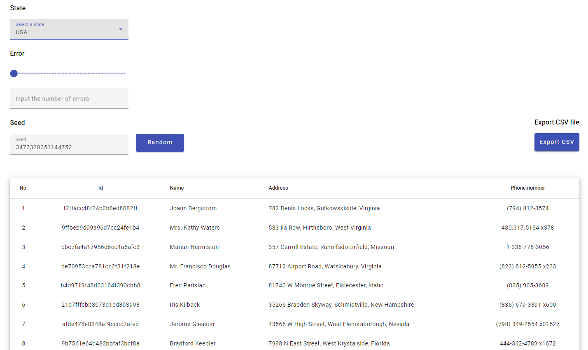

# FAKER-APP

 Faker-app is a web application for generating fake user data. Support is provided from 3 or more regions, the option of emulating incorrect user data input is available, as well as the ability to download the database in xlsx format.

Faker-app – это web-приложение для генерации фейковых пользовательских данных. Обеспечивается поддержка 3-х регионов, доступна опция эмуляции неправильного ввода данных пользователей, а также возможность выгрузить базу данных в формате xlsx.

